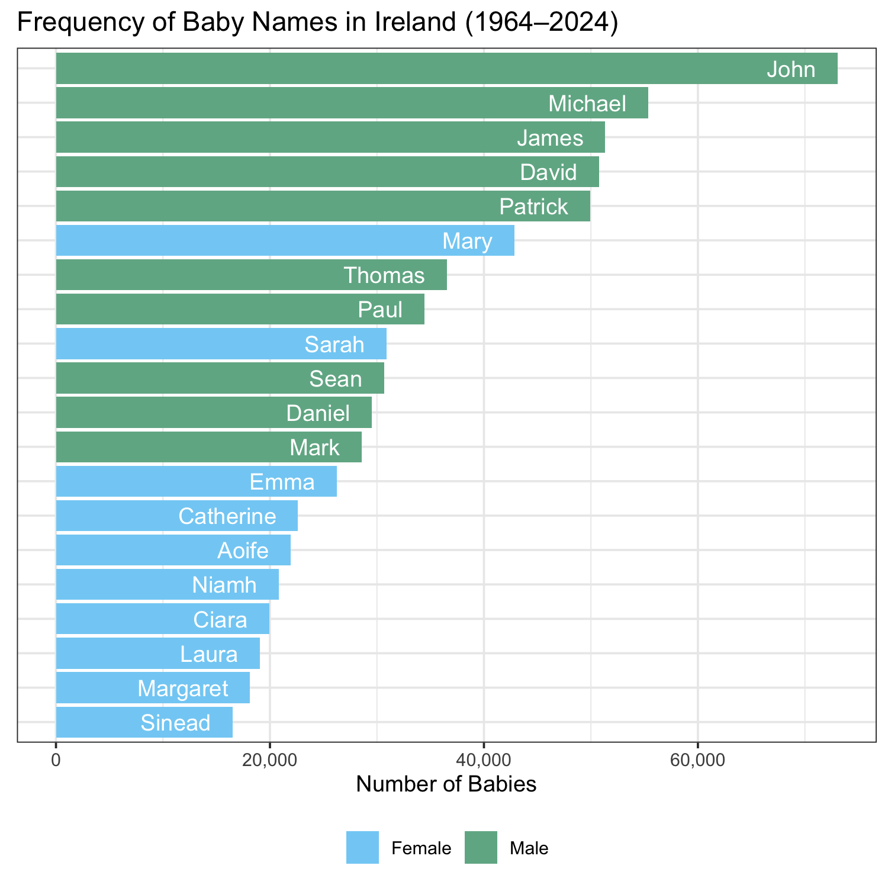
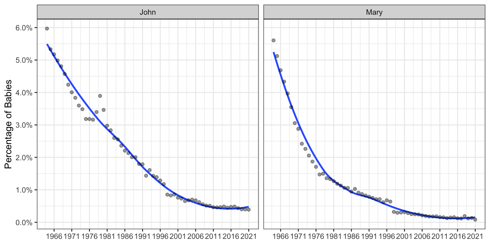
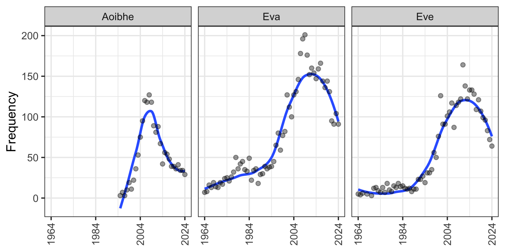

# iebabynames: Full baby name data for Ireland

## Description

Full baby name data (1964–2023) for Ireland, gathered from the [Central
Statistics
Office](https://www.cso.ie/en/interactivezone/visualisationtools/babynamesofireland/).

The package contains the dataset `iebabynames` with 78,897 observations
on six variables: `year`, `sex`, `name`, `n`, `rank`, and `prop`, and
`prop_sex`. Due to confidentiality reasons, only names with 3 or more
instances in the relevant year are included.

The package can be used to explore patterns of baby names in Ireland
over time. The dataset `iebabynames` is also very suitable for
filtering, summarising and plotting variables in workshops or lectures.

The structure of the package follows the
[**babynames**](https://cran.r-project.org/web/packages/babynames/index.html)
package by Hadley Wickham and the
[**ukbabynames**](https://mine-cetinkaya-rundel.github.io/ukbabynames/)
package by Mine Çetinkaya-Rundel, Thomas Leeper, and Nicholas
Goguen-Compagnoni.

## Installation

The package is hosted on GitHub and not available at CRAN. To install
the latest development version:

``` r
if (!require("remotes")) {
    install.packages("remotes")
}
remotes::install_github("stefan-mueller/iebabynames") 
```

## Demonstration

``` r
# load packages
library(iebabynames)
library(dplyr)
library(ggplot2)
library(scales)

# set ggplot2 theme
theme_set(theme_bw())

head(iebabynames)
##   year    sex   name   n rank        prop   prop_sex
## 1 2023 Female  Grace 339    1 0.007325137 0.01533728
## 2 2023 Female  Fiadh 300    2 0.006482422 0.01357282
## 3 2023 Female  Emily 297    3 0.006417598 0.01343709
## 4 2023 Female Sophie 283    4 0.006115085 0.01280369
## 5 2023 Female   Lily 270    5 0.005834180 0.01221554
## 6 2023 Female  Ellie 252    6 0.005445234 0.01140117
```

### Get most popular names in 2023

``` r
dat_top_2023 <- iebabynames %>% 
    filter(year == "2023") %>% 
    group_by(sex) %>% 
    top_n(n = 10, wt = -rank) # get top 10

dat_top_2023
## # A tibble: 20 × 7
## # Groups:   sex [2]
##     year sex    name        n  rank    prop prop_sex
##    <dbl> <chr>  <chr>   <int> <dbl>   <dbl>    <dbl>
##  1  2023 Female Grace     339     1 0.00733   0.0153
##  2  2023 Female Fiadh     300     2 0.00648   0.0136
##  3  2023 Female Emily     297     3 0.00642   0.0134
##  4  2023 Female Sophie    283     4 0.00612   0.0128
##  5  2023 Female Lily      270     5 0.00583   0.0122
##  6  2023 Female Ellie     252     6 0.00545   0.0114
##  7  2023 Female Mia       242     7 0.00523   0.0109
##  8  2023 Female Amelia    241     8 0.00521   0.0109
##  9  2023 Female Éabha     241     8 0.00521   0.0109
## 10  2023 Female Ella      231    10 0.00499   0.0105
## 11  2023 Male   Jack      561     1 0.0121    0.0232
## 12  2023 Male   Noah      473     2 0.0102    0.0196
## 13  2023 Male   James     369     3 0.00797   0.0153
## 14  2023 Male   Rían      339     4 0.00733   0.0140
## 15  2023 Male   Oisín     330     5 0.00713   0.0136
## 16  2023 Male   Fionn     306     6 0.00661   0.0127
## 17  2023 Male   Tadhg     301     7 0.00650   0.0125
## 18  2023 Male   Liam      289     8 0.00624   0.0120
## 19  2023 Male   Cillian   275     9 0.00594   0.0114
## 20  2023 Male   Daniel    256    10 0.00553   0.0106
```

### Plotting the 10 most frequent male and female names across the entire period

``` r
iebabynames_top <- iebabynames %>% 
    group_by(sex, name) %>% 
    summarise(n_total = sum(n)) %>% 
    top_n(n = 10, wt = n_total)

ggplot(iebabynames_top, aes(x = n_total,
                            y = reorder(name, n_total), 
                            fill = sex)) +
    geom_bar(stat = "identity") +
    geom_text(aes(label = name), nudge_x = -2000, 
              hjust = "right",
              colour = "white") +
    scale_x_continuous(labels = scales::comma_format()) +
    scale_fill_manual(values = c("#83D0F5", "#71B294")) +
    labs(title = "Frequency of Babynames in Ireland (1964--2023)", 
         x = "Number of Babies",
         y = NULL) +
    theme(axis.text.y = element_blank(),
          axis.ticks.y = element_blank(),
          legend.title = element_blank(),
          legend.position = "bottom") 
```

<!-- -->

### Inspecting the development of selected names

``` r
ggplot(data = filter(iebabynames, name %in% c("John", "Mary")),
       aes(x = year, y = prop)) +
    geom_smooth(se = FALSE) +
    scale_x_continuous(breaks = c(seq(1963, 2023, 10))) +
    scale_y_continuous(labels = scales::percent,
                       breaks = c(seq(0, 0.06, 0.01))) +
    geom_point(alpha = 0.4) +
    facet_wrap(~name) +
    labs(x = NULL, y = "Percentage of Babies") 
```

<!-- -->

### Explore different variants of names

``` r
iebabynames_variants <- iebabynames %>% 
    filter(name %in% c("Aoife", "Aoibhe", "Eva",
                       "Eve"))

ggplot(data = iebabynames_variants,
       aes(x = year, y = n)) +
    geom_smooth(se = FALSE) +
    scale_x_continuous(breaks = c(seq(1963, 2023, 20))) +
    geom_point(alpha = 0.4) +
    facet_wrap(~name, nrow = 1) +
    labs(x = NULL, y = "Frequency") +
    theme(axis.text.x = element_text(angle = 90, vjust = 0.5))
```

<!-- -->

The [website of the Central Statistics
Office](https://www.cso.ie/en/interactivezone/visualisationtools/babynamesofireland/)
includes an interactive interface that allows you to plot the frequency
and rank of custom names.

## How to cite

Stefan Müller (2024). *iebabynames: Ireland Baby Names, 1964–2023*. R
package version 0.2.4. URL:
<http://github.com/stefan-mueller/iebabynames>.

If you use the data, please also cite the CSO website:
<https://www.cso.ie/en/interactivezone/visualisationtools/babynamesofireland/>.

## Issues

Please file an issue (with a bug, wish list, etc.) [via
GitHub](https://github.com/stefan-mueller/iebabynames/issues).
