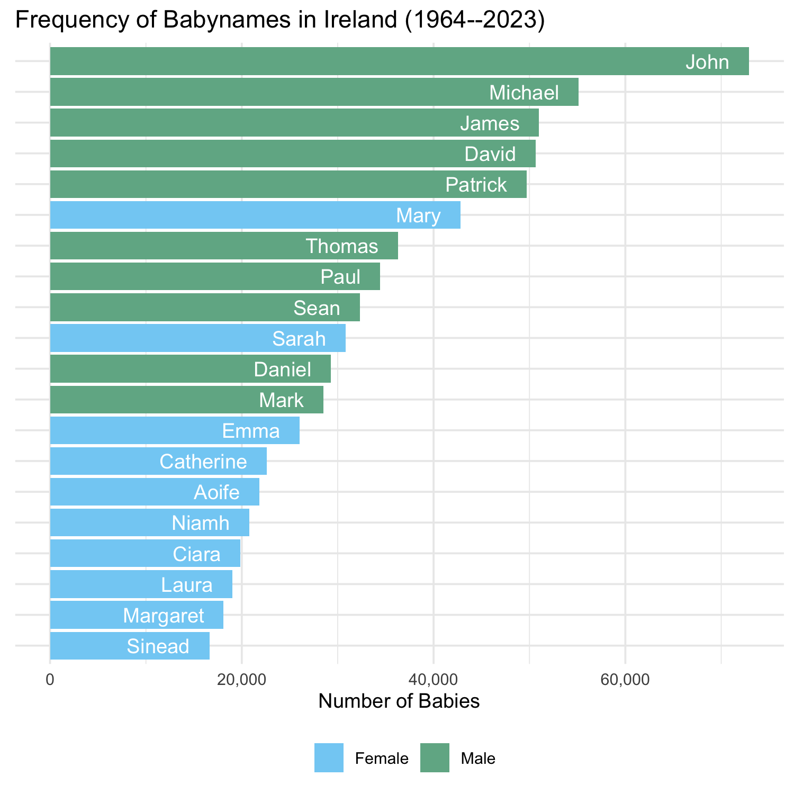

# iebabynames: Full baby name data for Ireland

## Description

Full baby name data (1964–2021) for Ireland, gathered from the [Central
Statistics
Office](https://www.cso.ie/en/interactivezone/visualisationtools/babynamesofireland/).

The package contains the dataset `iebabynames` with 74661 observations
on six variables: `year`, `sex`, `name`, `n`, `rank`, and `prop`. Due to
confidentiality reasons, only names with 3 or more instances in the
relevant year are included.

The package can be used to explore patterns of baby names in Ireland
over time. The dataset `iebabynames` is also very suitable for
filtering, summarising and plotting variables in workshops or lectures.

The structure of the package follows the
[**babynames**](https://cran.r-project.org/web/packages/babynames/index.html)
package by Hadley Wickham and the
[**ukbabynames**](https://mine-cetinkaya-rundel.github.io/ukbabynames/)
package by Mine Çetinkaya-Rundel, Thomas Leeper, and Nicholas
Goguen-Compagnoni.

## Installation

The package is hosted on GitHub and not available at CRAN. To install
the latest development version:

``` r
if (!require("devtools")) {
  install.packages("devtools")
}
devtools::install_github("stefan-mueller/iebabynames") 
```

## Demonstration

``` r
# load packages
library(iebabynames)
library(dplyr)
library(ggplot2)
library(scales)

head(iebabynames)
##   year    sex   name   n rank        prop
## 1 2021 Female  Fiadh 424    1 0.008322211
## 2 2021 Female  Grace 412    2 0.008086677
## 3 2021 Female  Emily 388    3 0.007615608
## 4 2021 Female Sophie 336    4 0.006594960
## 5 2021 Female  Éabha 288    5 0.005652822
## 6 2021 Female   Lucy 287    6 0.005633195
```

### Get most popular names in 2021

``` r
dat_top_2021 <- iebabynames %>% 
  filter(year == "2021") %>% 
  group_by(sex) %>% 
  top_n(n = 10, wt = -rank) # get top 10

dat_top_2021
## # A tibble: 20 × 6
## # Groups:   sex [2]
##     year sex    name        n  rank    prop
##    <dbl> <chr>  <chr>   <int> <dbl>   <dbl>
##  1  2021 Female Fiadh     424     1 0.00832
##  2  2021 Female Grace     412     2 0.00809
##  3  2021 Female Emily     388     3 0.00762
##  4  2021 Female Sophie    336     4 0.00659
##  5  2021 Female Éabha     288     5 0.00565
##  6  2021 Female Lucy      287     6 0.00563
##  7  2021 Female Mia       279     7 0.00548
##  8  2021 Female Ava       272     8 0.00534
##  9  2021 Female Lily      271     9 0.00532
## 10  2021 Female Ella      268    10 0.00526
## 11  2021 Male   Jack      667     1 0.0131 
## 12  2021 Male   Noah      475     2 0.00932
## 13  2021 Male   James     442     3 0.00868
## 14  2021 Male   Conor     360     4 0.00707
## 15  2021 Male   Rían      357     5 0.00701
## 16  2021 Male   Liam      353     6 0.00693
## 17  2021 Male   Charlie   345     7 0.00677
## 18  2021 Male   Daniel    325     8 0.00638
## 19  2021 Male   Cillian   322     9 0.00632
## 20  2021 Male   Tadhg     318    10 0.00624
```

### Inspecting how the most popular names in 2021 have developed over time

``` r
# combine name and sex for correct subsetting
dat_top_2021 <- dat_top_2021 %>% 
  mutate(name_sex = paste(name, sex, sep = "_"))  

# extract all years for the most frequent names in 2021
dat_top_timeseries <- iebabynames %>% 
  mutate(name_sex = paste(name, sex, sep = "_")) %>% 
  filter(name_sex %in% dat_top_2021$name_sex)

library(ggridges)

ggplot(data = dat_top_timeseries,
       aes(x = year, y = prop, colour = sex)) +
  scale_colour_manual(values = c("darkgreen", "grey50")) +
  scale_x_continuous(breaks = c(seq(1961, 2021, 10))) +
  scale_y_continuous(labels = scales::percent) +
  geom_point(alpha = 0.4) +
  facet_wrap(~name) +
  labs(x = NULL, y = "Percentage of Babies") +
  theme_bw() +
  theme(legend.title = element_blank(),
        axis.text.x = element_text(angle = 90, hjust = 0.5),
        legend.position = "bottom")
```

<!-- -->

### Inspecting the development of selected names

``` r
ggplot(data = filter(iebabynames, name %in% c("John", "Mary")),
       aes(x = year, y = prop)) +
  geom_smooth(se = FALSE) +
  scale_x_continuous(breaks = c(seq(1961, 2021, 5))) +
  scale_y_continuous(labels = scales::percent,
                     breaks = c(seq(0, 0.06, 0.01))) +
  geom_point(alpha = 0.4) +
  facet_wrap(~name) +
  labs(x = NULL, y = "Percentage of Babies") +
  theme_bw()
```

<!-- -->

### Plotting the 10 most frequent male and female names across the entire period

``` r
iebabynames_top <- iebabynames %>% 
  group_by(sex, name) %>% 
  summarise(n_total = sum(n)) %>% 
  top_n(n = 10, wt = n_total)

ggplot(iebabynames_top, aes(x = reorder(name, n_total),
                            y = n_total,
                            fill = sex)) +
  geom_bar(stat = "identity") +
  geom_text(aes(label = name), nudge_y = -2000, 
            hjust = "right",
            colour = "white") +
  scale_fill_manual(values = c("darkgreen", "grey50")) +
  coord_flip() +
  theme_bw() +
  labs(x = NULL, y = "Frequency (1964-2021)") +
  theme(axis.text.y = element_blank(),
        axis.ticks.y = element_blank(),
        legend.title = element_blank(),
        legend.position = "bottom") 
```

<!-- -->

### Exploring different variants of names

``` r
iebabynames_variants1 <- iebabynames %>% 
  filter(name %in% c("Aoife", "Aoibhe", "Eva",
                     "Eve"))

ggplot(data = iebabynames_variants1,
       aes(x = year, y = n)) +
  geom_smooth(se = FALSE) +
  scale_x_continuous(breaks = c(seq(1970, 2021, 20))) +
  geom_point(alpha = 0.4) +
  facet_wrap(~name, nrow = 1) +
  labs(x = NULL, y = "Frequency") +
  theme_bw()
```

<!-- -->

``` r
iebabynames_variants2 <- iebabynames %>% 
  filter(name %in% c("Eoin", "Eoghan", "Ewan",
                     "Owen"))


ggplot(data = iebabynames_variants2,
       aes(x = year, y = n)) +
  geom_smooth(se = FALSE) +
  scale_x_continuous(breaks = c(seq(1970, 2021, 20))) +
  geom_point(alpha = 0.4) +
  facet_wrap(~name, nrow = 1) +
  labs(x = NULL, y = "Frequency") +
  theme_bw()
```

<!-- -->

The [website of the Central Statistics
Office](https://www.cso.ie/en/interactivezone/visualisationtools/babynamesofireland/)
includes an interactive interface that allows you to plot the frequency
and rank of custom names.

## How to cite

Stefan Müller (2022). *iebabynames: Ireland Baby Names, 1964-2021*. R
package version 0.2.2. URL:
<http://github.com/stefan-mueller/iebabynames>.

If you use the data, please also cite the CSO website:
<https://www.cso.ie/en/interactivezone/visualisationtools/babynamesofireland/>.

## Issues

Please file an issue (with a bug, wish list, etc.) [via
GitHub](https://github.com/stefan-mueller/iebabynames/issues).
