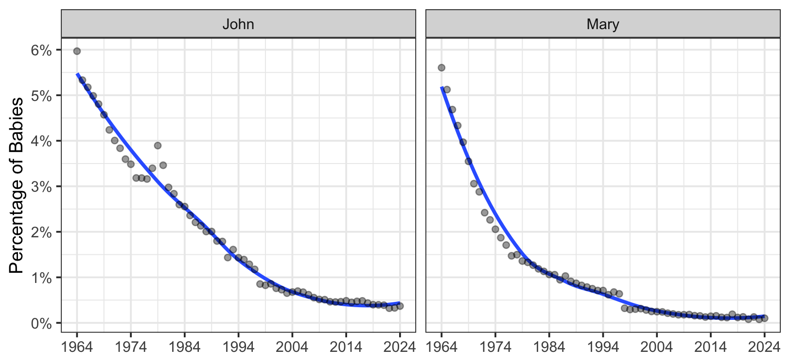

# iebabynames: Full baby name data for the Republic of Ireland

## Description

Full baby name data (1964–2019) for the Republic of Ireland, gathered
from the [Central Statistics
Office](https://www.cso.ie/en/interactivezone/visualisationtools/babynamesofireland/).

The package contains the dataset `iebabynames` with 70,567 observations
on six variables: `year`, `sex`, `name`, `n`, `rank`, and `prop`. Due to
confidentiality reasons, only names with 3 or more instances in the
relevant year are included.

The package can be used to explore patterns of baby names in Ireland
over time. The dataset `iebabynames` is also very suitable for
filtering, summarising and ploting variables in workshops or lectures.

The structure of the package follows the
[**babynames**](https://cran.r-project.org/web/packages/babynames/index.html)
package by Hadley Wickham and the
[**ukbabynames**](https://cran.r-project.org/web/packages/ukbabynames/index.html)
package by Thomas Leeper.

## Installation

The package is hosted on GitHub and not available at CRAN. To install
the latest development version:

``` r
if (!require("devtools")) {
    install.packages("devtools")
}
devtools::install_github("stefan-mueller/iebabynames") 
```

## Demonstration

``` r
# load packages
library(iebabynames)
library(tidyverse)

head(iebabynames)
## # A tibble: 6 x 6
##    year sex    name       n  rank    prop
##   <dbl> <chr>  <chr>  <int> <dbl>   <dbl>
## 1  2019 Female Emily    452     1 0.00863
## 2  2019 Female Grace    426     2 0.00814
## 3  2019 Female Fiadh    334     3 0.00638
## 4  2019 Female Sophie   330     4 0.00630
## 5  2019 Female Hannah   321     5 0.00613
## 6  2019 Female Amelia   315     6 0.00602
```

### Inspecting the development of selected names

``` r
iebabynames_subset <- iebabynames %>% 
    filter(name %in% c("Aisling", "Grace", "Mary",
                       "Emily", "Sophie", "Saoirse", "Paul",
                       "John", "Jack", "Patrick", "Noah",
                       "Conor"))

ggplot(data = iebabynames_subset,
       aes(x = year, y = n, colour = sex)) +
    scale_colour_manual(values = c("darkgreen", "grey50")) +
    geom_smooth(se = FALSE) +
    scale_x_continuous(breaks = c(seq(1965, 2020, 10))) +
    geom_point(alpha = 0.4) +
    facet_wrap(~name) +
    labs(x = NULL, y = "Frequency") +
    theme_bw() +
    theme(legend.title = element_blank(),
          legend.position = "bottom")
```

<!-- -->

### Plotting the 10 most frequent male and female names across the entire period

``` r

iebabynames_top <- iebabynames %>% 
    group_by(sex, name) %>% 
    summarise(n_total = sum(n)) %>% 
    top_n(n = 10, wt = n_total)

ggplot(iebabynames_top, aes(x = reorder(name, n_total),
                            y = n_total,
                            fill = sex)) +
    geom_bar(stat = "identity") +
    geom_text(aes(label = name), nudge_y = -2000, 
              hjust = "right",
              colour = "white") +
    scale_fill_manual(values = c("darkgreen", "grey50")) +
    coord_flip() +
    theme_bw() +
    labs(x = NULL, y = "Overall frequency (1964-2019)") +
    theme(axis.text.y = element_blank(),
          legend.title = element_blank(),
          legend.position = "bottom") 
```

<!-- -->

### Exploring different variants of names

``` r
iebabynames_variants1 <- iebabynames %>% 
    filter(name %in% c("Aoife", "Aoibhe", "Eva",
                       "Eve"))

ggplot(data = iebabynames_variants1,
       aes(x = year, y = n)) +
    geom_smooth(se = FALSE) +
    scale_x_continuous(breaks = c(seq(1970, 2020, 20))) +
    geom_point(alpha = 0.4) +
    facet_wrap(~name, nrow = 1) +
    labs(x = NULL, y = "Frequency") +
    theme_bw()
```

<!-- -->

``` r
iebabynames_variants2 <- iebabynames %>% 
    filter(name %in% c("Eoin", "Eoghan", "Ewan",
                       "Evan", "Owen"))


ggplot(data = iebabynames_variants2,
       aes(x = year, y = n)) +
    geom_smooth(se = FALSE) +
    scale_x_continuous(breaks = c(seq(1970, 2020, 20))) +
    geom_point(alpha = 0.4) +
    facet_wrap(~name, nrow = 1) +
    labs(x = NULL, y = "Frequency") +
    theme_bw()
```

<!-- -->

The [website of the Central Statistics
Office](https://www.cso.ie/en/interactivezone/visualisationtools/babynamesofireland/)
includes an interactive interface that allows you to plot the frequency
and rank of custom names.

## How to cite

Stefan Müller (2020). *iebabynames: Full baby name data for the Republic
of Ireland*. R package version 0.1.1. URL:
<http://github.com/stefan-mueller/iebabynames>.

For a BibTeX entry, use the output from `citation(package =
"iebabynames")`.

If you use the data, please also cite the CSO website:
<https://www.cso.ie/en/interactivezone/visualisationtools/babynamesofireland/>.

## Issues

Please file an issue (with a bug, wish list, etc.) [via
GitHub](https://github.com/stefan-mueller/iebabynames/issues).
